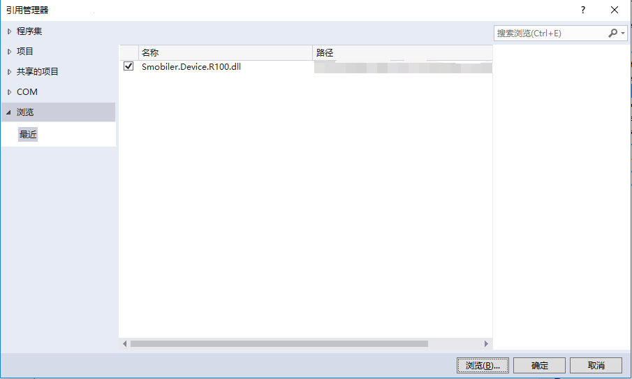
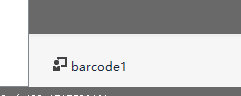
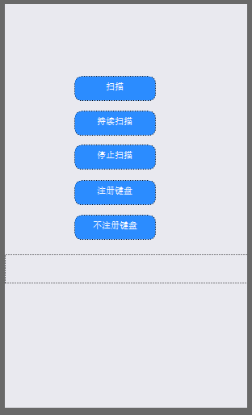

## R100扫描插件
#### 插件说明：
可使用R100扫描设备，进行条码扫描

#### 方法：
|方法|方法说明|
|:-|:-| 
|Scan（timeout）  | 扫描条码。timeout：超时时间，代表激光持续的时间，单位（秒），(1-600)，默认5|
|ScanContinuous（timeSpan）  | 持续扫描条码。扫描到结果后, 重新开始扫描, 直到调用ScanStop方法，timeSpan：持续扫描时间间隔，单位（0.1秒），(2-50），默认2|
|ScanStop  |停止扫描。在持续扫描条码时，调用后停止持续扫描|
|EnableTrigger  |启用扫描键(默认)|
|DisableTrigger  |禁用扫描键|
|BindKeyDown  |扫描键功能自定义|
|UnBindKeyDown  |扫描键功能不自定义(默认)|

#### 事件：
|事件|事件发生条件|
|:-|:-|
|BarcodeDataCaptured|条码扫描后发生|
|OnNotify|在方法调用返回通知时发生（仅在出现错误时触发）|
|KeyDown|按键后发生|

#### 插件使用：
### 一.插件打包

使用R100扫描插件需要先在云平台上打包。

打包完后安装app，在打包期间可以进行下一步操作。

### 二.Dll引用

在项目中引用R100的Dll

### 三.插件使用

在设计器中添加R100组件

并添加你所需的smobiler控件，例如下图

接下来调用你所需的方法即可。

###### 调用Barcode扫描：
    C#:
    //调用Barcode扫描
    private void btnScan_Press(object sender, EventArgs e)
    {
         this.barcode1.Scan();
    }
###### 条码扫描后接收事件中的信息：
    C#:
    //接收事件中信息
    private void barcode1_DataCaptured(object sender, Smobiler.Device.R100.R100BarcodeScanEventArgs e)
    {
        this.labData.Text = e.Data;
    }

### 四.源代码地址

