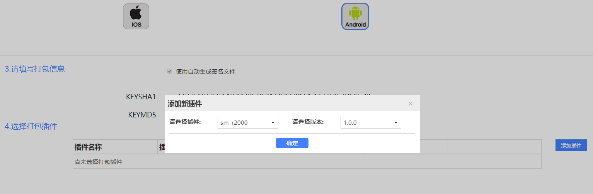
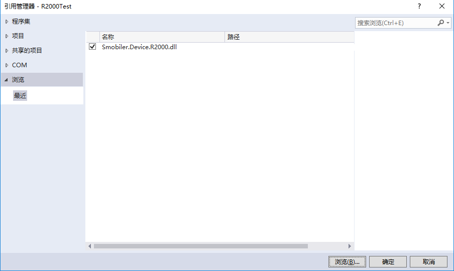
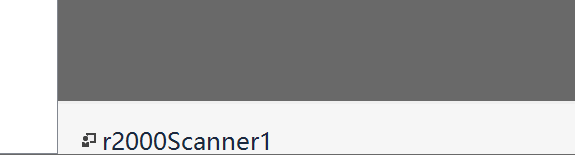
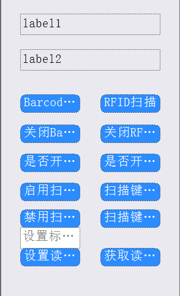

## R2000扫描插件
#### 插件说明：
可使用R2000扫描设备，进行条码与RFID的扫描

#### 方法：
|方法|方法说明|
|:-|:-| 
|BarcodeScan  | 扫描条码|
|BarcodeScanStop  | 停止条码扫描（在持续扫描条码时，调用后停止持续扫描）|
|BarcodeIsMulti  |是否开启连续扫描（true为开启，false为关闭（默认））|
|RFIDScan  |扫描RFID|
|RFIDScanStop  |停止RFID扫描|
|RFIDIsMulti  |是否开启多标签模式（true为开启，false为关闭（默认））|
|EnableTrigger  |启用扫描键|
|DisableTrigger  |禁用扫描键|
|BindKeyDown  |扫描键功能自定义（LeftTrigger\ RightTrigger）|
|UnbindKeyDown  |扫描键功能不自定义(默认)（F1\F2）|
|SetRFIDPower|设置RFID读写标签的功率（5-30）|
|GetRFIDPower|获取RFID读写标签的功率|

#### 事件：
|事件|事件发生条件|
|:-|:-| 
|BarcodeDataCaptured|条码扫描后发生|
|RFIDDataCaptured|RFID扫描后发生|
|OnNotify|在方法调用返回通知时发生|
|KeyDown|按键后发生|

#### 插件使用：
### 一.插件打包

使用R2000扫描插件需要先在云平台上打包。

打包完后安装app，在打包期间可以进行下一步操作。

### 二.Dll引用

在项目中引用R2000的Dll

### 三.插件使用

在设计器中添加R2000组件

并添加你所需的smobiler控件，例如下图

接下来调用你所需的方法即可。

###### 调用RFID扫描：
    C#:
    //调用RFID扫描
    private void btnRFIDscan_Press(object sender, EventArgs e)
    {
        r2000Scanner1.RFIDScan();
    }
###### RFID扫描后接收事件中的信息：
    C#:
    //接收事件中信息
    private void r2000Scanner1_FFIDDataCaptured(object sender, Smobiler.Device.R2000RFIDScanEventArgs e)
    {
        this.label1.Text = e.Epc;
        this.label2.Text = e.Rssi;
    }

### 四.源代码地址

