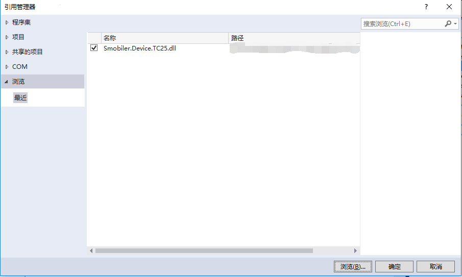
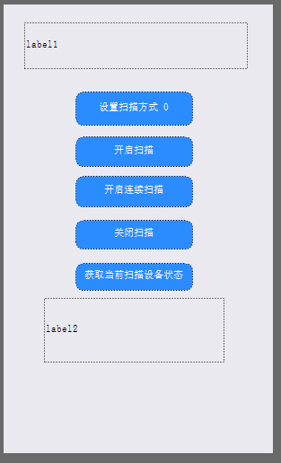

## TC25扫描插件
#### 插件说明：
可使用TC25扫描设备，进行条码扫描

#### 方法：
|方法|方法说明|
|:-|:-| 
|SetTriggerType|设置扫描方式 Hardware代表硬件的方式，TC25上的两个黄色键，按键扫描,Software代表软件的方式, 通过接口扫描|
|Scan|扫描条码|
|TimerScan|持续扫描条码|
|ScanStop|关闭扫描|
|Status|获取当前扫描设备状态|

#### 事件：
|事件|事件发生条件|
|:-|:-| 
|BarcodeDataCaptured|条码扫描后发生|
|OnNotify|在方法调用返回通知时发生|
|OnStatus|在方法调用当前扫描设备状态时发生|

#### 插件使用：
### 一.插件打包

使用TC25扫描插件需要先在云平台上打包。

打包完后安装app，在打包期间可以进行下一步操作。

### 二.Dll引用

在项目中引用TC25的Dll

### 三.插件使用

在设计器中添加TC25组件

并添加你所需的smobiler控件，例如下图

接下来调用你所需的方法即可。

###### 调用Barcode扫描：
    C#:
    //调用Barcode扫描
    private void btnscan_Press(object sender, EventArgs e)
    {
        this.barcode1.Scan();
    }
###### 条码扫描后接收事件中的信息：
    C#:
    //接收事件中信息
    private void barcode1_DataCaptured(object sender, TC25BarcodeScanEventArgs e)
    {
        this.label1.Text = e.Data;
    }

### 四.源代码地址

