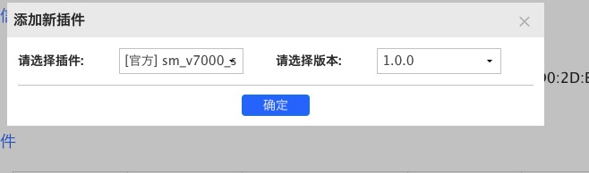
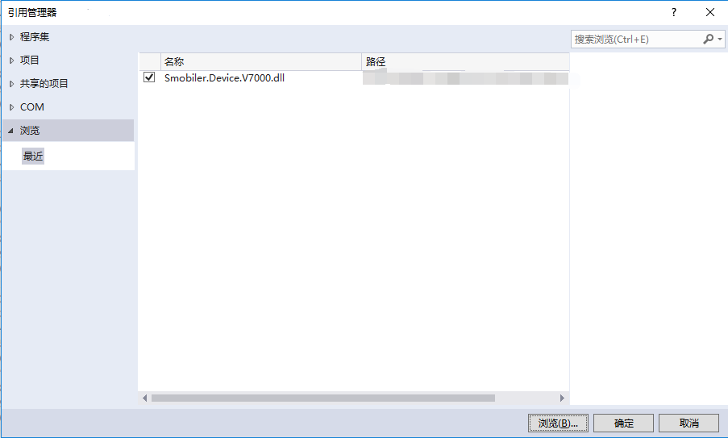
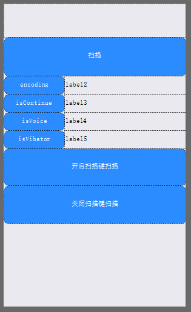

## V7000扫描插件
#### 插件说明：
可使用V7000扫描设备，进行条码扫描

#### 属性：
|属性|属性说明|
|:-|:-| 
|Encoding|数据的编码(gbk/utf-8)|
|IsContinue|是否持续扫描|
|IsVoice|扫描到结果时是否声音提示|
|IsVibator|扫描到结果时是否震动提示|

#### 方法：
|方法|方法说明|
|:-|:-| 
|Scan|启动扫描条码|
|EnableTrigger  |启用扫描键|
|DisableTrigger  |禁用扫描键|

#### 事件：
|事件|事件发生条件|
|:-|:-| 
|BarcodeDataCaptured|条码扫描后发生|
|OnNotify|在方法调用返回通知时发生（仅在出现错误时触发）|

#### 插件使用：
### 一.插件打包

使用V7000扫描插件需要先在云平台上打包。

打包完后安装app，在打包期间可以进行下一步操作。

### 二.Dll引用

在项目中引用V7000的Dll

### 三.插件使用

在设计器中添加V7000组件

并添加你所需的smobiler控件，例如下图

接下来调用你所需的方法即可。

###### 调用Barcode扫描：
    C#:
    //调用Barcode扫描
    private void btnScan_Press(object sender, EventArgs e)
    {
        barcode1.Scan();
    }
###### 条码扫描后接收事件中的信息：
    C#:
    //接收事件中信息
    private void barcode1_DataCaptured(object sender, V7000ScanEventArgs e)
    {
        label.Text = e.Data;
    }

### 四.源代码地址

